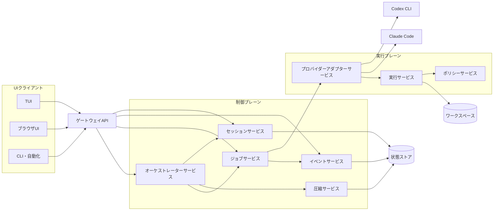
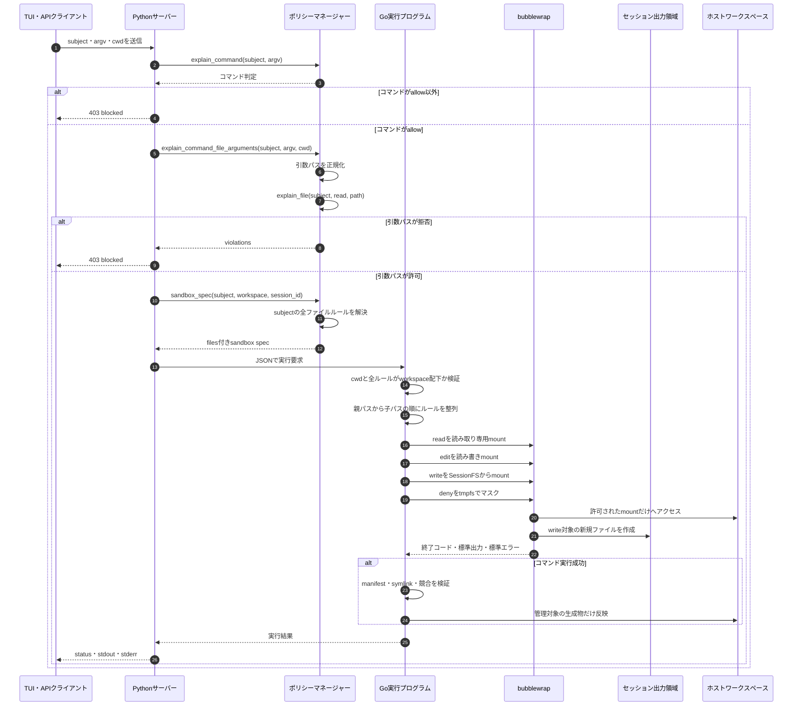
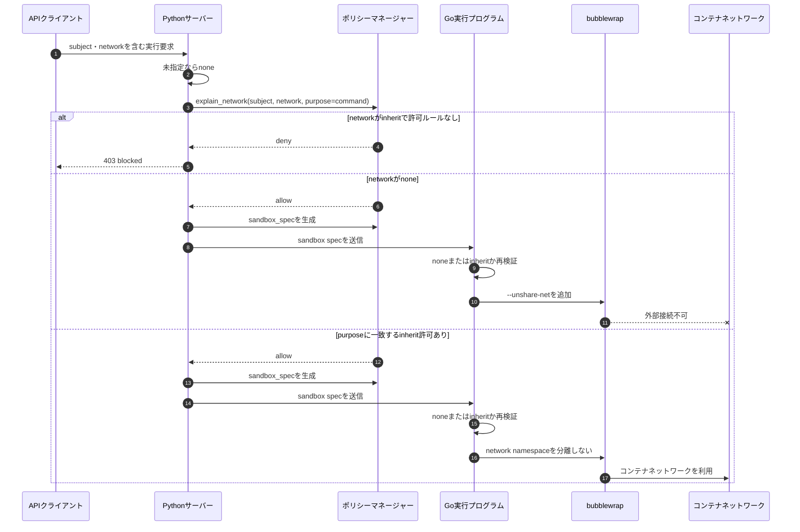
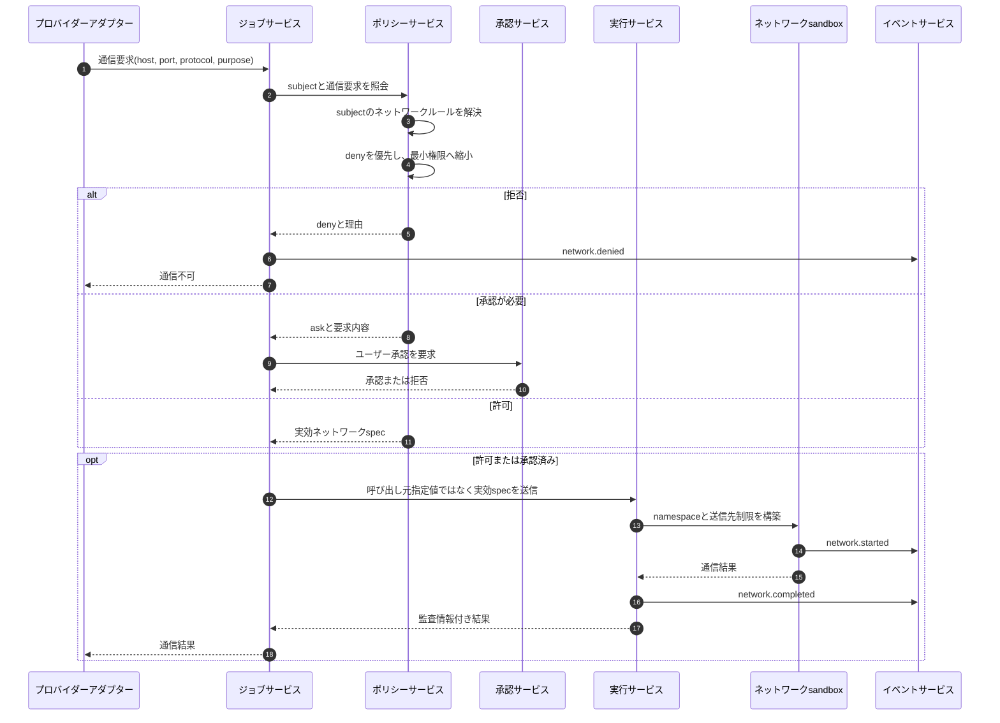
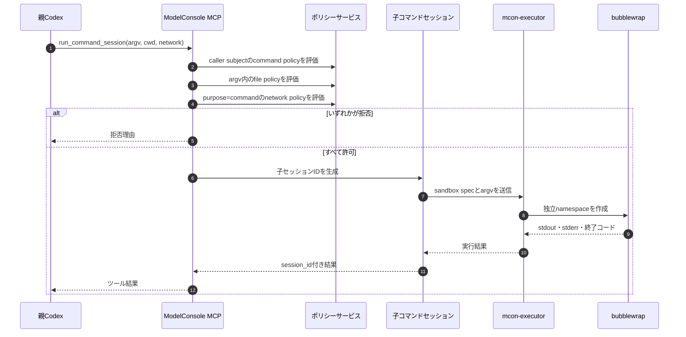
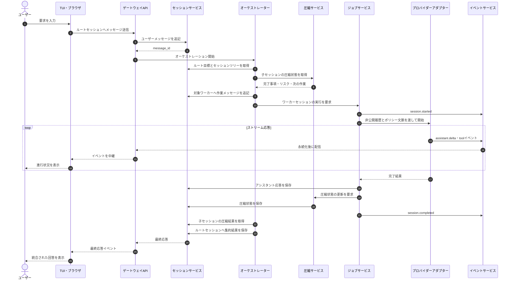
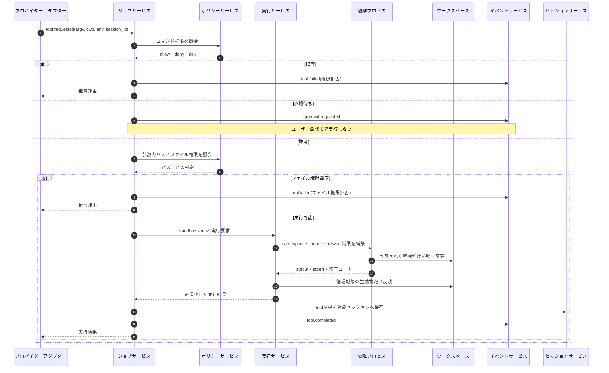
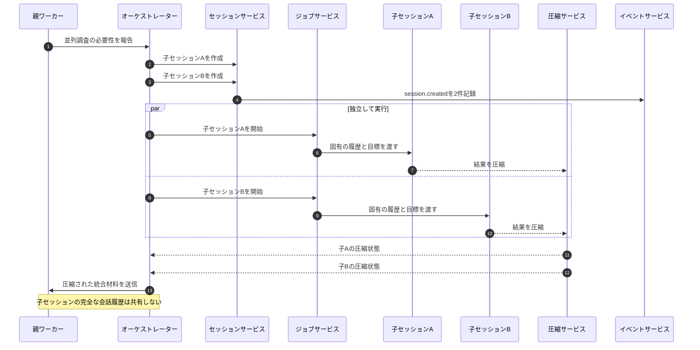
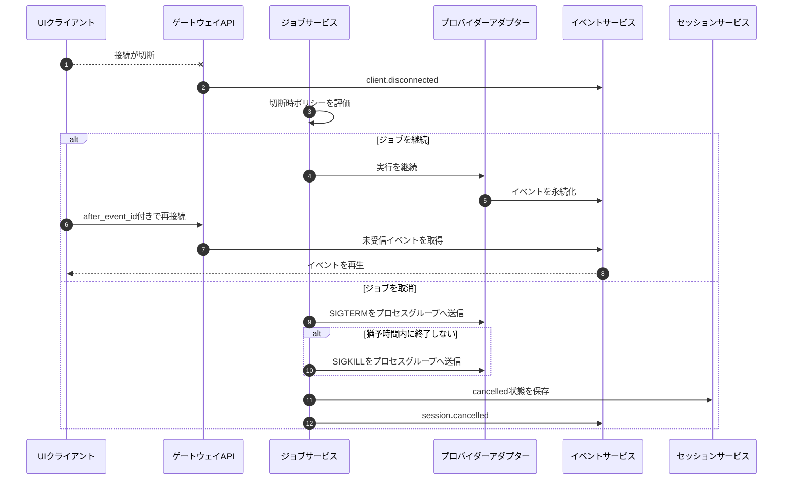

# セッションオーケストレーション設計

## 目的

ModelConsoleは、薄いUIクライアントの背後で、複数の独立したエージェントセッションを統括する。
最初のUIはTUIだが、将来ブラウザUIや自動化クライアントへ置き換えても、会話状態や実行状態を
UIへ移さずに利用できる構成とする。

目標とする動作は次のとおり。

- 各セッションが固有の非公開会話履歴を保持する。
- エントリーポイントとオーケストレーターは、完全な会話履歴ではなく圧縮状態を介して他セッションを統括する。
- ワーカーセッションは、必要に応じて自身の配下へサブエージェントセッションを作成できる。
- UIクライアントは安定したAPIを通じて状態を表示し、入力やコマンドを送信する。
- セッション、イベント、ジョブ、プロバイダー、ポリシー、実行環境を独立したサービス境界として扱う。
- CodexやClaude Codeなど、プロバイダー固有の会話形式をModelConsole内部へ漏らさない。

## 設計原則

### セッションの独立性

セッションごとに会話履歴、実行中ジョブ、圧縮状態、成果物、承認待ち状態を分離する。
親セッションや兄弟セッションであっても、他セッションの完全な会話履歴を直接参照しない。

### エントリーポイントの責務

エントリーポイントはユーザーとの窓口であり、各ワーカーの処理を直接実行しない。
ユーザー入力をルートセッションへ保存し、オーケストレーターへ目的と制約を伝え、
集約済みの結果をユーザーへ返す。

### 圧縮言語による連携

セッション間では、自由形式の全履歴ではなく短い構造化状態を交換する。
これにより、コンテキスト量、情報漏えい、セッション間の不要な依存を抑える。

### UIとバックエンドの分離

TUIは会話履歴やプロセスの正式な所有者にならない。
TUI、ブラウザ、CLI自動化は、すべて同じゲートウェイAPIとイベントストリームを利用する。

### 実行権限の強制

プロンプト内のポリシー説明は補助情報にすぎない。
コマンド、ファイル、ネットワーク、認証情報の権限は、ポリシーサービスと実行サービスが
実行経路上で強制する。

## 全体アーキテクチャ

MVPでは単一のPythonプロセス内に実装してよいが、モジュールとAPIの境界は
将来のマイクロサービス分離を前提とする。



## サービスの責務

### ゲートウェイAPI

ゲートウェイAPIは次を担当する。

- HTTPルーティング
- リクエストの形式検証
- 認証と認可
- レスポンスの符号化
- APIバージョンの互換性維持
- UI向けイベントストリームの接続受付

オーケストレーション判断やプロバイダー固有のストリーム解析は担当しない。
既存の`mcon.server.app`は、段階的にこの責務へ縮小する。

### セッションサービス

セッションサービスは次を所有する。

- セッションの作成とメタデータ更新
- ルート、親、子セッションの関係
- セッション固有の非公開会話履歴
- 圧縮状態
- セッション状態遷移
- セッションツリーの検索
- セッション単位の排他制御

完全な会話履歴を読み取れるのは、そのセッションを実行するプロバイダーだけとする。
親、エントリーポイント、兄弟セッションは、圧縮状態と明示的なイベントだけを参照する。

### イベントサービス

イベントサービスは追記専用イベントログとUIへの配信を担当する。
UIやオーケストレーターが必要とする状態変化は、すべてイベントとして記録する。

イベントは配信前に永続化する。再接続したクライアントはイベントIDを使って未受信分を再生できる。
遅いクライアントがプロバイダー実行を停止させないよう、永続化と配信キューを分離する。

### ジョブサービス

ジョブサービスは実行プロセスのライフサイクルを所有する。

- 原則として1セッションにつき実行中ジョブは1つ
- ジョブの開始、完了、失敗、取消
- 割り込みとタイムアウト
- クライアント切断時の扱い
- サーバー停止時の子プロセス回収
- プロセスグループ単位の終了

長時間動作するプロバイダープロセスを、TUIのデーモンスレッドだけで所有してはならない。

### オーケストレーターサービス

オーケストレーターサービスは、タスク分解とセッション間の調整を担当する。
ワーカーの非公開会話履歴は参照しない。

オーケストレーターの入力は次から構成する。

- 現在のユーザー要求
- ルートセッションの目標
- セッションツリーのメタデータ
- 各子セッションの圧縮状態
- 直近の明示的イベント
- 未解決のブロッカー
- 承認待ち操作
- 利用可能な予算と並列数

作業を割り当てる場合は、対象ワーカーセッションへメッセージを追記し、ジョブサービスへ実行を依頼する。

### 圧縮サービス

圧縮サービスは、セッションの圧縮状態を更新する。
通常はプロバイダージョブ完了後に実行し、必要に応じて明示的にも呼び出せる。

圧縮状態は、オーケストレーションに必要な事実だけを短く保持する。

```text
@session sess_worker_abc
状態=実行中
目標="分離されたセッションAPIを実装する"
完了=["SessionStoreの骨格を追加", "イベントスキーマを作成"]
リスク=["割り込みAPIが未接続"]
要求=[]
次="プロバイダーアダプターをジョブサービスへ接続する"
成果物=["packages/mcon/src/mcon/server/sessions.py"]
```

圧縮時には、推測と確認済み事実を区別する。認証情報、完全なプロンプト、不要なコマンド出力を含めない。

### プロバイダーアダプターサービス

プロバイダーアダプターサービスは、Codex CLI、Claude Code、将来のプロバイダー差異を吸収する。

- 共通の実行要求をプロバイダー固有コマンドへ変換する。
- プロバイダー固有ストリームをModelConsoleイベントへ正規化する。
- プロセスの所有権をジョブサービスへ渡す。
- ツール要求を構造化し、ポリシーサービスと実行サービスへ渡す。
- 完了した応答だけをセッションサービスへ保存する。

Codexの例:

```text
codex exec --json --cd <作業ディレクトリ> -
```

Docker内でCodex自身のsandboxを使用するとseccompが利用できない環境がある。
そのため、プロバイダー内部sandboxへ依存せず、実行サービスが外側から実行全体を隔離する構成を目標とする。

また、ModelConsoleがセッションとサブエージェントを統括する場合、プロバイダー内部の
自動multi-agent機能は無効にし、二重オーケストレーションを避ける。

### ポリシーサービス

ポリシーサービスは次を担当する。

- subjectからの権限解決
- コマンド権限
- ファイル権限
- ネットワーク権限
- 認証情報の利用権限
- コマンド引数に含まれるパスの解析
- 判断理由の説明

### 実行サービス

実行サービスは、隔離されたコマンド実行とセッションファイルシステムの反映を担当する。

コマンドが許可されていても、引数として任意パスを読めるとは限らない。
たとえば`git diff`が許可されていても、次の実行で`/etc/passwd`を読めてはならない。

```text
git diff --no-index /etc/passwd /workspace/README.md
```

実行サービスはコマンド権限とファイル権限の両方を検証する。
また、`/etc`全体のような広いホストディレクトリをsandboxへ公開しない。
実行時に必要なファイルがある場合は、必要最小限のパスだけを読み取り専用で提供する。

## ポリシー適用の詳細

ポリシーは、説明用プロンプトではなく、ゲートウェイAPIから実行サービスへ至る実行経路上で適用する。
ただし、現行実装ではファイル権限とネットワーク権限の完成度が異なる。

| 対象 | 現行実装 | 強制場所 | 残っている課題 |
|---|---|---|---|
| コマンド権限 | subjectに紐づく`allow`、`deny`、`ask`を解決する | Pythonサーバーの`PolicyManager.explain_command` | `ask`の承認処理は未完成 |
| ファイル権限 | subjectに紐づく`deny`、`read`、`write`、`edit`を解決する | PythonのポリシーマネージャーとGo実行プログラムのbubblewrap mount | コマンド引数解析は一部コマンドだけ |
| ネットワーク権限 | subject、mode、purposeに一致するルールを解決する | PythonのポリシーマネージャーとGo実行プログラムのnetwork namespace | 現状は`none`とコンテナネットワーク継承だけで、宛先単位allowlistは未実装 |
| 認証情報 | コマンドポリシーに利用名を保持する | 現状は説明と解決が中心 | 実行時注入と利用監査を統合する必要がある |

### subjectとポリシーの解決

実行要求には`mcon.agent.coder`のようなsubjectを含める。
ポリシーマネージャーはsubject定義の`uses`を読み、参照されたポリシーを宣言順に結合する。

現行設定の例:

```toml
[agent.coder]
uses = [
  "workspace",
  "git",
]

[agent.auditor]
uses = [
  "workspace-readonly",
]
```

`coder`はワークスペースの読み取り、`generated`への新規作成、`docs`の編集、
Gitコマンドポリシーを持つ。`auditor`はワークスペースの読み取りだけを持つ。

複数のファイルルールが同じパスへ一致した場合、後に解決されたルールを最終判断に使う。
ポリシーマネージャーは一致パスの長さで自動的に優先順位を決めないため、ポリシーの宣言順が意味を持つ。
たとえば`/workspace`の`read`より後に`/workspace/docs`の`edit`があるため、
`/workspace/docs/plan.md`には`edit`が適用される。
さらに後ろの`/workspace/secrets`に`deny`があるため、秘密領域は読み取り対象から除外される。

### ファイルアクセス権限の判定

ファイル権限の操作と許可範囲は次のとおり。

| action | 許可する操作 | 用途 |
|---|---|---|
| `deny` | なし | 対象パスを不可視にする |
| `read` | `stat`、`list`、`read` | 読み取り専用参照 |
| `write` | `create` | セッション出力領域への新規作成 |
| `edit` | `stat`、`list`、`read`、`create`、`write` | 既存内容を含む編集 |

`delete`と`rename`は現行の許可行列に含まれないため、ルールが存在しても許可されない。

パスは判定前に絶対POSIXパスへ正規化する。
`/workspace/../etc/passwd`は`/etc/passwd`として評価され、
`/workspace`配下の許可へ誤って一致しない。

ファイル権限は2段階で適用する。

1. Python側で、コマンド引数として明示されたパスを事前判定する。
2. Go実行プログラム側で、許可されたパスだけをbubblewrapのmountとして公開する。

現行のコマンド引数解析は`git diff --no-index`に対応している。
引数中の相対パスは`cwd`を基準に絶対パスへ変換し、各パスを`read`操作として
`PolicyManager.explain_file`へ渡す。1つでも拒否された場合はexecutorを起動しない。

すべてのコマンドについて引数の意味を汎用的に推測することはできないため、
任意パスを扱うコマンドごとに構造化された引数解析器を追加する。
解析器がないコマンドについても、最終的な読み書き可能範囲はbubblewrap mountで制限する。

### ファイルポリシーからsandboxへの変換

`PolicyManager.sandbox_spec`は、解決済みファイルルールを次の形式へ変換する。

```json
{
  "enabled": true,
  "workspace": "/workspace",
  "network": "none",
  "session_id": "mcon_agent_coder--session-a",
  "session_root": "/mcon/session-fs",
  "files": [
    {"action": "read", "path": "/workspace"},
    {"action": "write", "path": "/workspace/generated"},
    {"action": "edit", "path": "/workspace/docs"},
    {"action": "deny", "path": "/workspace/secrets"}
  ]
}
```

Go実行プログラムはルールをパスの短い順にmountする。
親パスを先に、具体的な子パスを後にmountすることで、子パスの制限を上書き適用する。

| ファイルaction | bubblewrapへの変換 | ホスト側への影響 |
|---|---|---|
| `read` | `--ro-bind-try <path> <path>` | 読み取り専用 |
| `edit` | `--bind-try <path> <path>` | 対象ホストパスを直接編集可能 |
| `write` | セッション専用ディレクトリを`--bind` | 実行中はホストへ直接書かない |
| `deny` | 対象へ`--tmpfs` | 下位の内容を空の領域で隠す |

`write`は「既存ファイルの編集」ではなく「管理された新規生成」を表す。
実行中は`/mcon/session-fs`配下のセッション専用領域へ出力し、コマンド成功後に
`applySessionWrites`がホストワークスペースへ反映する。

反映時には次を検証する。

- 出力先がワークスペース配下であること
- 出力にsymlinkや未対応ファイル種別が含まれないこと
- 親ディレクトリにホスト側symlinkがないこと
- 既存ファイルを上書きする場合、mconのmanifestに管理対象として記録されていること
- 並行反映時にワークスペース単位のファイルロックを取得すること

### ファイルアクセス権限の現行フロー



### ネットワークアクセス権限の現状

ネットワークポリシーはsubjectの`uses`から解決し、`mode`と`purpose`の両方が一致した場合だけ許可する。
現行の`provider-network`ポリシーは、`purpose=provider`に限って`mode=inherit`を許可する。
`coder`と`auditor`はこのポリシーを参照するため、CodexプロセスはモデルAPIへ接続できる。

`/api/exec`は`purpose=command`として判定する。リクエストから`network=inherit`を指定しても、
command用途に一致する許可ルールがないため、executorを起動する前に拒否する。
`network=none`は通信を無効にする指定なので、明示的な許可ルールがなくても利用できる。

Go実行プログラムが受理する値は次の2つだけである。

| network | executorの処理 | 結果 |
|---|---|---|
| `none` | bubblewrapへ`--unshare-net`を追加 | 独立したnetwork namespaceとなり、外部ネットワークへ接続できない |
| `inherit` | `--unshare-net`を追加しない | コンテナのネットワークを継承する |

これ以外の値はexecutorがエラーとして拒否する。

`inherit`は宛先ホスト、ポート、プロトコルを制限しない。
将来のネットワークポリシーでは、最低限次を区別する。

- `none`: 全通信を禁止
- `dns-only`: 名前解決だけを許可
- `allowlist`: 指定ホスト、ポート、プロトコルだけを許可
- `inherit`: 管理者が明示的に許可したsubjectだけがコンテナネットワークを継承

### ネットワークアクセス権限の現行フロー



### ネットワークアクセス権限の目標フロー

目標構成では、クライアントは必要な通信要件を要求できるが、最終的なネットワークモードを決定しない。
ポリシーサービスがsubject、コマンド、セッション種別、要求先、承認状態から実効ポリシーを生成する。



ネットワークポリシーの例:

```toml
[policy.network-default.network.egress]
action = "deny"

[policy.network-github.network.github-api]
action = "allow"
hosts = ["api.github.com", "github.com"]
ports = [443]
protocols = ["tcp"]

[policy.network-github.network.other]
action = "deny"
```

実装時はDNS解決後のIP差し替え、リダイレクト、IPv6、プロキシ経由、Unix socket、
コンテナ内localhostへの接続も考慮する。ホスト名だけの事前判定で完結させず、
実行時の通信経路で強制し、イベントへ宛先と判定結果を記録する。

### chat・プロバイダー実行への適用範囲

`/api/exec`と`/api/chat/stream`は、どちらもmcon executorを通る。
chatではCodexプロセス全体をbubblewrap namespace内で起動し、親Codexの内蔵shellは無効化する。

chatのファイルルールはsubjectポリシーから生成した後、`read-only` profileへ縮退する。
`edit`は`read`へ変換し、`write`専用パスは`deny`としてmaskする。
そのため、Codex内蔵shellを含む全子プロセスが同じmount制約を継承する。

CodexはモデルAPI通信が必要なため、`purpose=provider`として`inherit`を要求する。
ポリシーサービスが許可した場合だけコンテナネットワークを継承する。

Codexは実行中にruntime homeへ書き込むため、元の認証ボリュームを直接mountしない。
`auth.json`と`installation_id`だけを実行ごとの`/mcon/provider-runtime`へコピーし、
そのセッションコピーをnamespaceへ書き込み可能mountする。
Codex実体の`packages`は読み取り専用mountし、セッションコピーはプロセス終了時に削除する。
`auth.json`はCodexが最初のstdoutイベントを返した時点で削除し、
通常のツール実行が始まる前にファイルとして参照できる時間を閉じる。

親Codexでは`shell_tool`と`unified_exec`を無効化する。コマンド実行はModelConsoleの
`run_command_session` MCPツールだけを使用する。MCPツール呼び出しごとに、
親とは異なる子セッションIDを生成し、別の`mcon-executor`プロセスとbubblewrap namespaceを起動する。
子セッションはcaller agentのcommand、file、network policyを再評価する。
したがって、親Codexはshellを直接所有せず、コマンドの標準出力と終了状態だけをツール結果として受け取る。



残る設計課題は次のとおり。

- `inherit`を宛先ホスト、ポート、プロトコル単位のallowlistへ置き換える。
- 認証ファイル削除前の短い初期化区間も完全に分離するため、将来は認証プロキシへ移行する。
- networkとfileの拒否をEvent Serviceの監査イベントとして永続化する。

## エントリーポイントから応答までのフロー

### 会話コンテキストの送信と応答

ユーザー入力はエントリーポイントで受け付け、ルートセッションへ保存する。
オーケストレーターは、ワーカーの完全な履歴ではなく圧縮状態を使って割り当てを決める。



### コマンド実行フロー

プロバイダーがコマンド実行を必要とした場合、直接ホストで実行せず、
ポリシーサービスと実行サービスを通過させる。



### サブエージェントの生成と統括

サブエージェントは、プロバイダー内部の暗黙的なforkではなく、
ModelConsoleのセッションサービスを通じて明示的な子セッションとして作成する。



### 切断、取消、失敗時のフロー

UI切断をプロバイダージョブの所有権喪失と同一視しない。
ジョブはサーバー側で管理し、明示的な取消またはポリシーに従って継続・停止を判断する。



## データモデル

### セッション

```python
@dataclass
class Session:
    session_id: str
    root_session_id: str
    parent_session_id: str | None
    kind: Literal[
        "entrypoint",
        "orchestrator",
        "worker",
        "subagent",
        "reviewer",
    ]
    subject: str
    provider: str
    cwd: str
    sandbox: Literal["read-only", "workspace-write"]
    status: Literal[
        "idle",
        "running",
        "blocked",
        "waiting_approval",
        "complete",
        "failed",
        "cancelled",
    ]
    goal: str
    created_at: str
    updated_at: str
```

`session_id`はサーバーが生成する。クライアント指定値をそのままファイルパスへ使用しない。
形式は`sess_[A-Za-z0-9_-]+`のような固定プレフィックスと制限された文字集合にする。

### メッセージ

```python
@dataclass
class Message:
    message_id: str
    session_id: str
    role: Literal["system", "user", "assistant", "tool"]
    content: str
    created_at: str
    metadata: dict[str, object]
```

メッセージは原則として所属セッションだけが参照する。
他セッションへ伝える情報は、圧縮状態または明示的な成果物として複製する。

### イベント

```python
@dataclass
class SessionEvent:
    event_id: str
    root_session_id: str
    session_id: str
    parent_session_id: str | None
    type: str
    created_at: str
    payload: dict[str, object]
```

主要イベント:

```text
session.created
session.updated
session.started
session.completed
session.failed
session.cancelled
message.appended
assistant.delta
stderr.line
tool.requested
tool.started
tool.completed
tool.failed
approval.requested
approval.resolved
compressed_state.updated
artifact.created
client.disconnected
```

### ジョブ

```python
@dataclass
class Job:
    job_id: str
    session_id: str
    provider: str
    status: Literal["running", "completed", "failed", "cancelled"]
    started_at: str
    completed_at: str | None
```

プロセスオブジェクトは永続化せず、ジョブサービスのメモリ内で管理する。
永続ストアには再起動後に判断できるジョブ状態とイベントだけを保存する。

## 状態ストレージ

MVPでは、確認と移行が容易なJSONとJSONLを使用する。
複数プロセス間ロックや高度な検索が必要になった時点でSQLiteまたはPostgreSQLへ移行する。

会話履歴、圧縮状態、イベントログには、ユーザープロンプト、モデル出力、パス、
コマンド出力、認証情報名が含まれ得る。そのため、既定では対象ワークスペース内へ保存しない。

```text
MCON_STATE_ROOT=/mcon/state
```

ローカル開発でリポジトリ配下を使う場合は明示的に設定し、`.mcon/`を`.gitignore`へ追加する。

```text
MCON_STATE_ROOT=.mcon/state
```

保存構成:

```text
/mcon/state/
  sessions/
    sess_entry_001/
      session.json
      messages.jsonl
      events.jsonl
      compressed.txt
    sess_worker_abc/
      session.json
      messages.jsonl
      events.jsonl
      compressed.txt
```

書き込み規則:

- イベントはJSONLへ追記する。
- 配信前にflushまたはfsyncする。
- メタデータと圧縮状態は一時ファイルへ書き、renameで置換する。
- メタデータと会話履歴の更新にはセッション単位のロックを使う。
- 全セッションを止めるグローバルロックは、明示したMVP制約以外では使用しない。

## API設計

すべてのUIクライアントが同じAPIを利用する。

```text
POST /api/sessions
GET  /api/sessions
GET  /api/sessions/{session_id}
GET  /api/sessions/{session_id}/tree

POST /api/sessions/{session_id}/messages
POST /api/sessions/{session_id}/runs
POST /api/sessions/{session_id}/interrupt
POST /api/sessions/{session_id}/compact

GET  /api/events/stream?root_session_id=...
GET  /api/sessions/{session_id}/events

POST /api/policy/explain-command
POST /api/policy/explain-file
POST /api/executor/run
```

セッションIDを受け取るすべてのAPIは、対象セッションが呼び出し元のルートセッションまたは
認可済みスコープに所属することを検証する。

### セッション作成

```http
POST /api/sessions
```

```json
{
  "kind": "worker",
  "parent_session_id": "sess_orchestrator_001",
  "root_session_id": "sess_entry_001",
  "subject": "mcon.agent.coder",
  "provider": "codex",
  "cwd": "/workspace",
  "sandbox": "read-only",
  "goal": "セッション分離を実装する"
}
```

`root_session_id`が省略された場合は、新しいセッション自身をルートにする。

### メッセージ追記

```http
POST /api/sessions/{session_id}/messages
```

```json
{
  "role": "user",
  "content": "次の実装工程へ進んでください。",
  "metadata": {
    "source": "tui"
  }
}
```

このAPIはメッセージだけを追記し、プロバイダー実行は開始しない。

### 実行開始

```http
POST /api/sessions/{session_id}/runs
```

```json
{
  "mode": "normal"
}
```

レスポンス:

```json
{
  "job_id": "job_123",
  "session_id": "sess_worker_abc",
  "status": "running"
}
```

実行中セッションへの2件目の開始要求は拒否する。
キュー機能を追加する場合も、開始済みジョブとは別のpending状態として明示する。

### 実行の割り込み

```http
POST /api/sessions/{session_id}/interrupt
```

対象セッションのアクティブジョブを終了し、`session.cancelled`を記録する。
中途半端なアシスタント応答を通常の完了メッセージとして保存しない。

### イベントストリーム

MVPではNDJSONを使用できる。

```http
GET /api/events/stream?root_session_id=sess_entry_001&after_event_id=evt_100
```

```json
{"type":"session.started","session_id":"sess_worker_abc","payload":{"job_id":"job_123"}}
{"type":"assistant.delta","session_id":"sess_worker_abc","payload":{"text":"..."}}
{"type":"compressed_state.updated","session_id":"sess_worker_abc","payload":{"state":"@session sess_worker_abc\n状態=待機中\n..."}}
{"type":"session.completed","session_id":"sess_worker_abc","payload":{"returncode":0}}
```

ブラウザ向けには、同じイベントサービスの上へSSEまたはWebSocketを追加できる。

必要な再接続・流量制御:

- `after_event_id`による再生
- 履歴取得件数の上限またはページング
- 遅いクライアントごとの配信キュー
- クライアント切断とジョブ所有権の分離
- 完全な非公開会話履歴をイベントへ含めない

## ローカルAPIの安全性

ブラウザUIを追加すると、悪意あるWebサイトからlocalhost APIへアクセスされる可能性がある。
ブラウザクライアントを有効にする前に、次を実装する。

- ローカル認証トークンまたはセッションCookie
- OriginとHostの検証
- 状態変更APIに対するCSRF対策
- 既定で無効なCORS
- リクエスト本文サイズの上限
- ルートセッション単位の認可
- 外部インターフェースへbindする場合の明示的な設定

TUI専用の信頼済みローカルモードを残す場合も、設定で明示し、`/status`へ表示する。

## プロンプト構築

### ワーカーセッション

ワーカーのプロンプトには次だけを含める。

- そのワーカー固有の非公開会話履歴
- セッションの目標
- subject、cwd、sandboxに対応するポリシー文脈
- 親から明示的に渡された圧縮情報

兄弟セッションの会話履歴は含めない。

### オーケストレーターセッション

オーケストレーターは圧縮状態だけを使用する。

```text
あなたはModelConsoleのオーケストレーターです。
子セッションは圧縮状態だけを使って調整してください。
圧縮状態にない非公開会話の内容を推測しないでください。

ルート目標:
...

子セッション:
@session sess_worker_abc
状態=実行中
...

最新のユーザー要求:
...
```

詳細が不足する場合、対象ワーカーへ追加報告または再圧縮を要求する。
非公開会話履歴を直接取得して補ってはならない。

## TUIの変更方針

TUIから正式な会話状態の所有権を外す。

- `TuiState.messages`を長期保存先として使わない。
- `/api/chat/stream`直接呼び出しをセッションAPIへ置き換える。
- `GET /api/events/stream`のイベントを表示する。
- ローカルには選択中セッション、入力バッファ、表示設定だけを保持する。

想定コマンド:

```text
/sessions
/tree
/new worker "目標..."
/session sess_worker_abc
/send sess_worker_abc "メッセージ..."
/run sess_worker_abc
/interrupt sess_worker_abc
/compact sess_worker_abc
/status
```

通常入力はアクティブセッションへユーザーメッセージを追記し、実行中でなければジョブを開始する。
実行中の入力はpendingキューへ保持し、現在の応答完了後に順番どおり処理する。
並列作業が必要な場合は、同一会話内で複数ジョブを走らせず、別セッションを明示的に作成する。

## PR #3への対応

### sandboxのファイルポリシー回避

即時対応:

- Executor sandboxからホスト`/etc`全体のbindを削除する。
- 空のファイルルールをワークスペース全体の`edit`へ変換しない。
- `git diff --no-index`の引数パスをファイルポリシーで検査する。
- `/workspace/../etc/passwd`のような親ディレクトリ参照を正規化する。

後続対応:

- コマンド引数解析をポリシーサービスの正式な責務にする。
- 実行サービスでコマンド権限とファイル権限を常に組み合わせる。
- 拒否されたパスアクセスをイベントとして記録する。

### chatの`workspace-write`

即時対応:

- プロバイダーのツールを実行サービスへ転送できるまでは拒否する。
- 書き込みが必要なコマンドは`/exec`からmcon executorを通して実行する。

後続対応:

- プロバイダーアダプターがツール要求を構造化イベントとして公開する。
- ワークスペース変更は実行サービスだけが適用する。
- 同じコマンド・ファイルポリシーを強制できた後に限り、chatの書き込みを再有効化する。

### ジョブの終了処理

即時対応:

- ストリーム処理を`try/finally`で囲む。
- 切断や書き込み失敗時にプロセスグループへ`SIGTERM`を送る。
- 猶予時間後も残る子プロセスへ`SIGKILL`を送る。

後続対応:

- ジョブサービスを導入する。
- `/api/sessions/{session_id}/interrupt`を追加する。
- 完了、失敗、取消イベントをサーバー側のジョブ所有者が発行する。

### 会話順序

即時対応:

- 同一TUIセッションのchat実行を直列化する。
- pendingメッセージを現在の応答が完了するまで会話履歴へ追加しない。
- 応答の完了順で一つの履歴へ混在させない。

後続対応:

- 会話履歴の所有権をセッションサービスへ移す。
- 並列作業は独立したワーカーセッションとして表現する。
- オーケストレーターサービスが圧縮状態を使って統合する。

## 移行計画

1. PR #3のsandbox、書き込み、プロセス回収、会話順序の問題を修正する。
2. `schemas.py`、`events.py`、`sessions.py`を追加する。
3. セッション作成、メッセージ追記、イベント追記・取得APIを実装する。
4. `jobs.py`を追加し、プロバイダープロセスの所有と割り込みを実装する。
5. Codexストリーム処理を`server.providers.codex`へ移す。
6. `/api/sessions/{id}/runs`と`/interrupt`を実装する。
7. `/api/chat/stream`を互換用の薄い変換APIにする。
8. TUIをセッションAPIとイベントストリームへ移行する。
9. `compression.py`を追加し、実行後に圧縮状態を更新する。
10. `orchestrator.py`を追加し、圧縮状態だけを使う統括処理を実装する。
11. Codex内部multi-agentを無効化し、サブエージェント生成をセッションサービスへ集約する。
12. プロバイダーアダプター全体を実行サービスの外側sandboxで実行する。
13. イベントサービスが安定した後、ブラウザ向けSSEまたはWebSocketを追加する。

## 安全性に関する確認事項

- chatの`workspace-write`をmcon executorの強制と同一視しない。
- コマンド許可だけで任意のファイルアクセスを許可しない。
- ホストの広いディレクトリをsandboxへ公開しない。
- ワーカーの非公開会話履歴を親や兄弟へ漏らさない。
- セッション状態を対象ワークスペースへ既定保存しない。
- 取消済みのプロバイダープロセスや子プロセスを残さない。
- 失敗した部分応答を通常の完了応答として保存しない。
- 永続化前にイベントを配信しない。
- UI切断だけでジョブ状態を失わない。
- クライアントに任意の親子関係を作らせない。
- ブラウザ向け保護なしでlocalhost APIを公開しない。
- ModelConsoleとプロバイダー内部で二重にサブエージェントを統括しない。
- Docker内部のseccomp対応を仮定せず、起動時に実行環境の能力を検証する。

## 初期テスト範囲

- ルートIDと親IDを持つセッション作成
- セッション間のメッセージ分離
- イベントの追記順と再生順
- 圧縮状態の読み書き
- 同一セッションの同時実行拒否
- 実行中ジョブの割り込み
- 子プロセスを含むプロセスグループの回収
- オーケストレータープロンプトへ非公開履歴が混入しないこと
- `/api/chat/stream`互換動作
- ポリシー外パスを含むコマンドの拒否
- chatの`workspace-write`拒否
- ストリーム切断時のプロバイダープロセス回収
- pending入力の会話順序
- イベントストリーム再接続時の未受信イベント再生
- 子セッションが兄弟セッションの履歴を参照できないこと
- Codex内部multi-agentが無効化されていること
- sandbox機能不足を起動時またはヘルスチェックで検出できること
